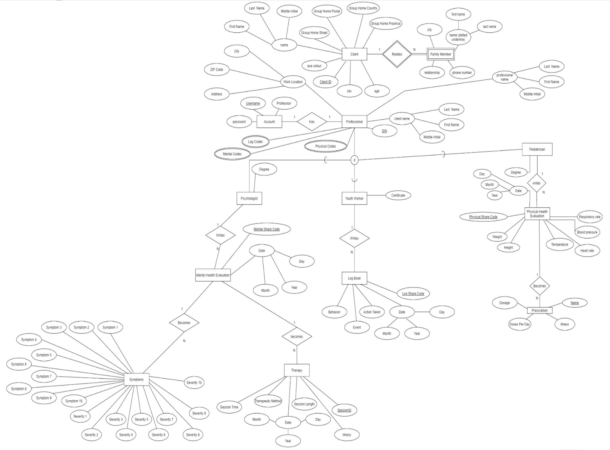
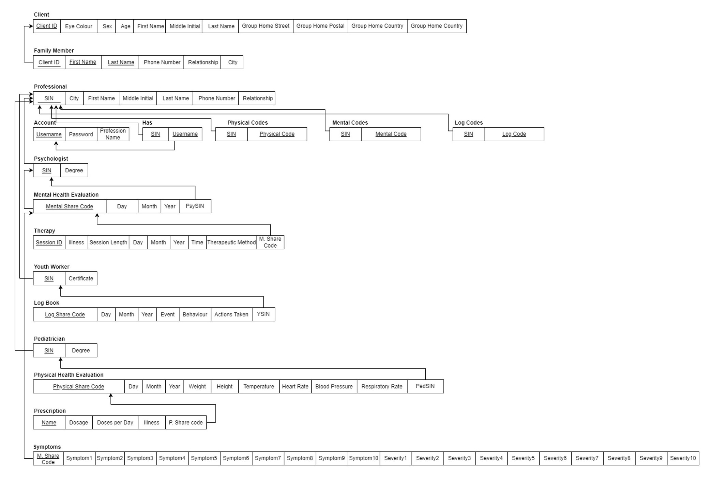

# Group Home Data Management Application 

The Group Home Data Management App is a Flask-based web application designed to facilitate the management and sharing of health records among group home professionals. Group homes, inherently complex environments with involvement from various professionals, often encounter issues related to data sharing and organization. This application supports different user roles, including Youth Workers, Pediatricians, and Psychologists, each with specialized functionalities tailored to their professions.

## Features

1. **Profession-Specific Dashboards:** Each user type (Youth Worker, Pediatrician, Psychologist) has a dedicated dashboard providing relevant features and information.

2. **Upload Health and Incident Records:** Professionals can upload Physical Health Evaluations (PHEs), Mental Health Evaluations (MHEs), and Log Book entries.

3. **Share Health and Incident Records:** Users can share their health or incident records with other professionals by providing share codes.

4. **View Shared Files:** A universal shared files page displays records shared with the user, making collaboration and information exchange seamless.

## Prerequisites

Before running the application, ensure that you have the following dependencies installed:

- Python (3.7 or higher)
- Flask
- MySQL Database

## Database Design

### Extended Entity-Relationship Model (EER)



### Relational Model (RM)



## Getting Started

1. **Clone the repository to your local machine:**

    ```bash
    git clone https://github.com/yourusername/Group-Home-Data-Management-Web-Application.git
    ```

2. **Install the required Python packages:**

    ```bash
    pip install Flask==2.0.1 requests==2.26.0 mysql-connector-python==8.0.28 Flask-MySQLdb==0.2.0
    ```

3. **Set up the MySQL database:**

    - Create a new database.
    - Update the `DatabaseConfig.py` file with your database connection details.
    - Upload the sql file in the SQL_Files folder into the database

4. **Run the application:**

    ```bash
    python main.py
    ```

5. **Access the application:**

    Visit http://127.0.0.1:5000/ in your web browser.

## Usage

1. Visit the login page and enter your credentials based on your professional role.
2. Navigate through the dashboard to upload, view, and share health and incident records.
3. Explore the shared files page to access records shared with you by other professionals.


